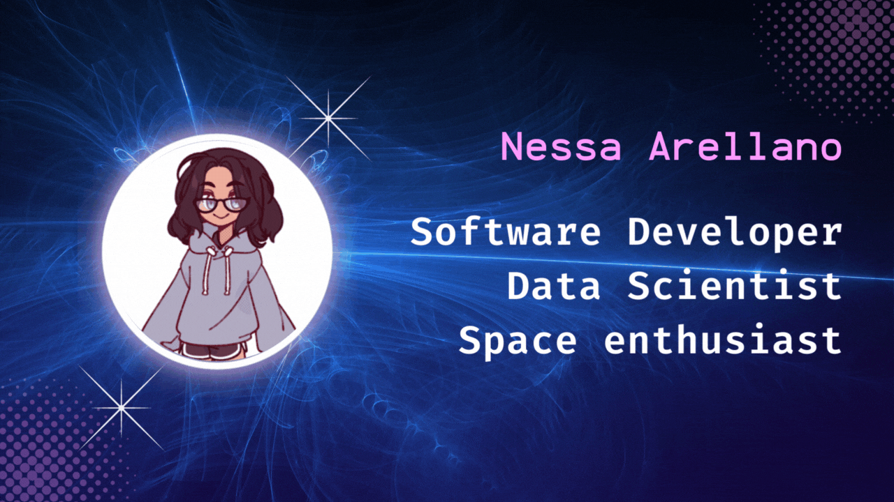

    

    

| 🌸 | 🌸|
| :----   |          ---: |
| |

    

## Hi there! 

👨🏻‍💻  About Me...

🏫  I'm currently studying Computer Science - Intelligent Computing at Autonumous University of Aguascalientes.

🚀  I'm on track for learning more about Front-End development and cloud architechture. My main skills are backend development, data science and machine learning. 

❤️  One of my greatest passions is create cool stuffs with software.

💡  I like to develop new software solutions, learn about new technologies and make problem solving for fun.

💼  I'm looking for an internship or part time job/project to apply my skills and expand my knowledge.

🌟 I work every day to be better and give my share to the tech community 

✉️  You can shoot me an email at vanessaserna60@gmail.com!

🙌 Thank ypu for reading me, I'm open to feedback and suggestions!
